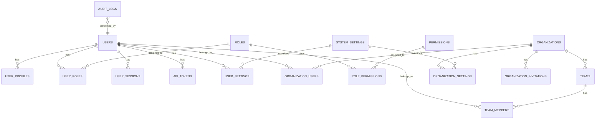
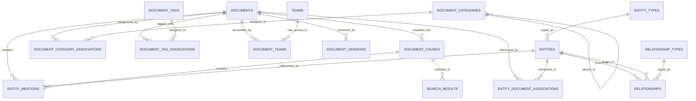
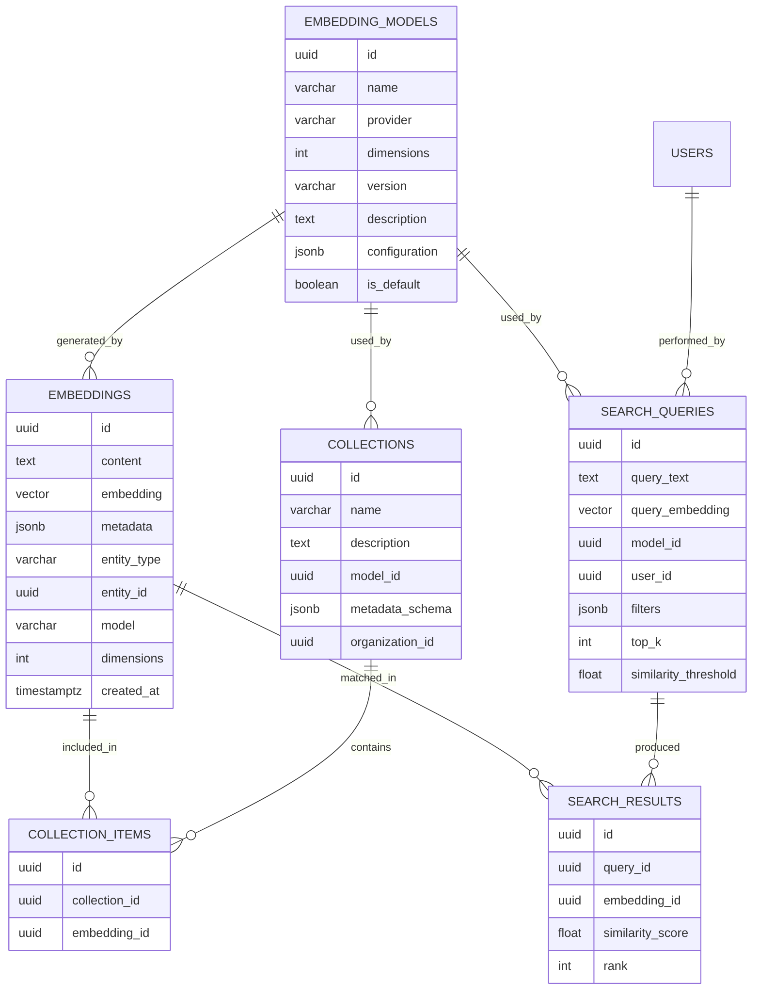
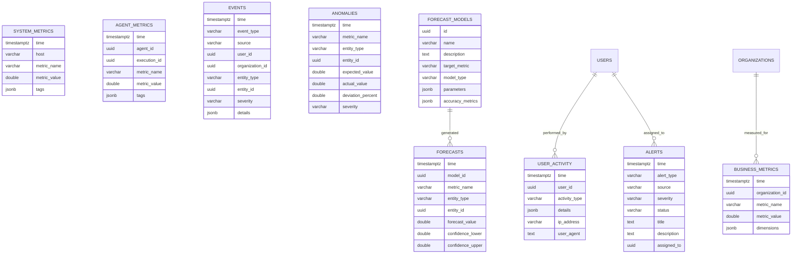
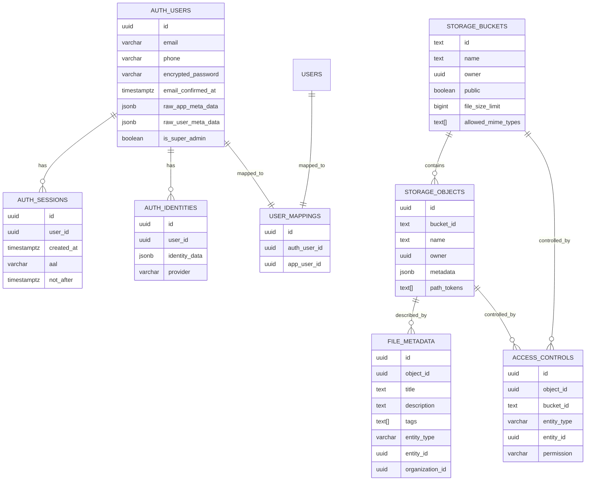
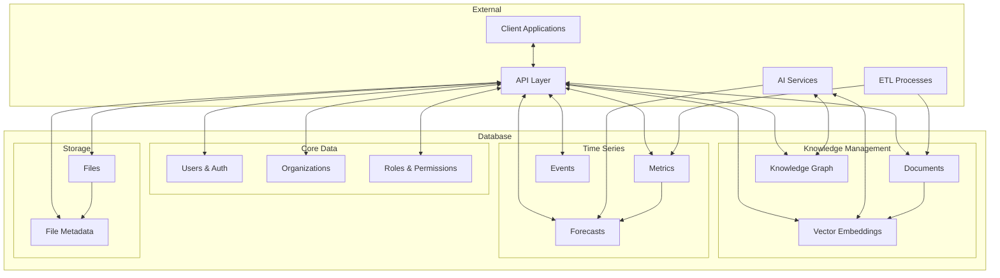

# Cauldron sEOS Database Schema Diagram

This document provides a visual representation of the Cauldron sEOS database schema using Mermaid diagrams.

## Core Schema Relationships

## Lore Module (Vector Database)

## Vector Module (Generic Embeddings)

## TimeSeries Module

## Supabase Integration

## Physical Storage Organization

```mermaid
graph TD
    subgraph PostgreSQL
        subgraph Extensions
            PGVector["PGVector (vector)"]
            TimescaleDB["TimescaleDB"]
            PostGIS["PostGIS (geospatial)"]
            pgRouting["pgRouting (graph)"]
            UUID["uuid-ossp"]
            Crypto["pgcrypto"]
            FTS["pg_trgm (full-text search)"]
        end
        
        subgraph Schemas
            Public["public (core)"]
            Lore["lore (knowledge)"]
            TimeSeries["timeseries (metrics)"]
            Vector["vector (embeddings)"]
            CommandCauldron["command_cauldron (agents)"]
            Synapse["synapse (BI)"]
            Aegis["aegis (security)"]
            Integration["integration"]
            Supabase["supabase, auth, storage, realtime"]
            Audit["audit"]
            Admin["admin"]
        end
        
        subgraph Optimizations
            Indexes["Indexes"]
            VectorIndexes["HNSW Vector Indexes"]
            Partitioning["Time-based Partitioning"]
            ContinuousAggregates["Continuous Aggregates"]
            RLS["Row-Level Security"]
        end
    end
    
    Extensions --> Schemas
    Schemas --> Optimizations
```

## Data Flow

This diagram provides a visual representation of the Cauldron sEOS database schema, showing the relationships between tables and the overall architecture. You can render these diagrams using Mermaid-compatible tools or viewers.